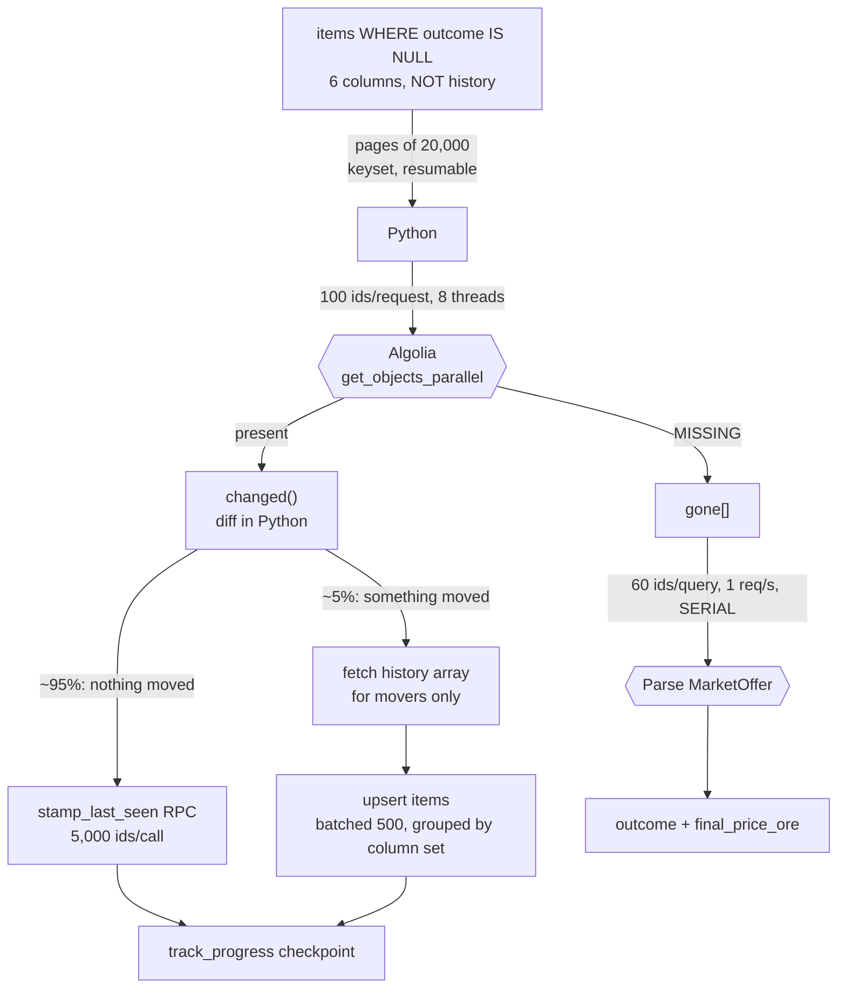

# Architecture — how Loppan actually runs

Written 2026-08-14. The system as built, for someone picking it up cold.

`overview.md` is *why* the project exists and what it is trying to measure.
`schema.md` is what lands in each column. `analytics.md` is what is derived
afterwards. **This file is the machine**: where the data comes from, what moves it,
where it lands, what runs it, and which parts are load-bearing.

Read `api-notes.md` before writing any query against a source. Read `pi-runner.md`
before touching `runs-on:` in any workflow.

---

## 0. The one-paragraph version

Every other day, a GitHub Actions job reads ~669,000 enrolled items out of a
Supabase Postgres over HTTP, re-fetches the same ids from Sellpy's public Algolia
search index, diffs them in Python, and writes back only what moved (~5%). Items
that have **vanished** from Algolia are adjudicated against Sellpy's Parse backend,
which is authoritative on whether they sold. Three Postgres functions then rebuild
the analytics layer. Separately, a rotation job sweeps whole brands into a transient
staging table every two hours to compute peer prices for the undervalued pool. A
Lovable dashboard reads the results.

Nothing authenticates as a Sellpy user. Nothing writes to Sellpy. There is no
purchasing logic anywhere in this repository.

---

## 1. ⚠️ This is not scraping

The single most common wrong assumption about this project, and it changes every
downstream decision — rate limits, fragility, legal posture, and whether the
ingestion could be moved elsewhere.

**There is no HTML parsing anywhere in this codebase.** All three sources are JSON
APIs, reached with client credentials that every visitor's browser already holds,
served in plain text inside `https://www.sellpy.se/market/index.*.bundle.js`.

| Source | Endpoint | Credentials | What it uniquely has |
|---|---|---|---|
| **Algolia** (`algolia.py`) | `M6WNFR0LVI-dsn.algolia.net`, index `prod_marketItem_se_relevance`, ~12.5M docs | Search-only key, scoped, public by design | The whole market. `weight`, `priceDrop_SE.oldPrice`, regional favourite buckets, `firstOfferedAt_SE`. **`favouriteCount` exists nowhere else** |
| **Parse** (`sellpy.py`) | `sellpy-parse-prod.herokuapp.com/parse` | Browser SDK app-id + JS key, public by design | `itemStatus` — authoritative on sold vs delisted vs returned. Full `MarketOffer` price ladders, readable long after sale |
| **Typesense** (`search.py`) | — | — | `priceToEstimateRatio`, `sellabilityEstimate`. A ~5% subset (586,746 docs), largely abandoned |

Verified 2026-08: only 6.8% of Algolia items appear in Typesense, while 99.8% of
Typesense items appear in Algolia. The Typesense path is legacy; `track.yml` records
that the Typesense sweep was removed.

⚠️ **`price_to_estimate` is now null on all live items.** The one field that could
have said *cheap against worth* rather than *cheap against peers* is gone. See
`dashboard-plan.md`.

### The two rate-limit judgements are different, and deliberately so

This distinction is written into `algolia.py:52` and must survive any refactor:

- **Algolia gets 8 threads at 50 ms intervals.** It is third-party CDN
  infrastructure built for query load — the storefront fires several requests per
  page view. A modest parallel read rate is unremarkable there.
- **Parse gets 1 request per second, strictly serial.** It is Sellpy's own backend.
  **The risk there is the account, not the server.**

Do not "optimise" the second one to match the first.

### What the sources will silently lie about

| Trap | Consequence |
|---|---|
| Filtering Algolia on an unconfigured attribute returns **0, not an error** | `isOnShelf:true` matches nothing. Use `isForSale:true` |
| Every filtered `nbHits` comes back `exhaustiveNbHits: false` | Counts are estimates, sometimes badly off |
| A single Algolia query shape stops paginating at ~2,000 results whatever `nbHits` claims | The rest of the shape is **invisible**. See §4.2 |
| Parse returns a bare **HTTP 500** on any query over ~10 s | Means "unindexed query", not "broken request". `sellpy.QueryTooSlow` |
| Walking a live index returns some rows twice and skips others | Two rows with one id in a PostgREST upsert fails the **whole batch** |
| Sold items are **deleted** from Algolia | This is a feature — see §3 |

---

## 2. The storage layer

Supabase project `zgqywowejxtokqsybqnu` (`Loppan`, `eu-north-1`), **free tier**.

Reached over HTTPS through **PostgREST**, never a Postgres wire connection. The
entire client is `loppan/db.py` — 350 lines, **stdlib only, no dependencies**, which
is why every workflow can skip `pip install` entirely.

```
db.upsert(table, rows, on_conflict)   POST,  batched at 500
db.update(table, rows, key)           PATCH, one request per row
db.query(path)                        GET,   pages by Range header
db.query_pages(path, key, after)      GET,   keyset pagination, generator
db.delete(path)                       DELETE, filter required by PostgREST
db.count(path)                        HEAD + Prefer: count=exact
db.rpc(name, params)                  POST /rpc/, raw http.client for keepalives
```

Auth is the **service-role key** from `LOPPAN_SUPABASE_KEY`, which bypasses RLS. It
is never committed and never reaches a browser. Every table has RLS on with a policy
scoped `to authenticated using (is_allowed())`; views are `security_invoker = on` and
inherit it. Anonymous callers get `401`.

⚠️ **Supabase grants `select` on every new view to `anon` by default.** RLS still
stops the read, but a `security_invoker` view then makes `anon` evaluate
`is_allowed()`, which it cannot execute — so the endpoint answers with the name of an
internal function instead of an empty result. **Revoke explicitly when adding a view.**

### Four traps encoded in `db.py`, each of which cost something

1. **PostgREST caps a response at 1000 rows regardless of any `limit`, and returns
   the truncated page without complaining.** This silently cost 300 of 1300 cohort
   items once. `query()` now pages by `Range` header by default.
2. **`query_pages` seeks by key, not by offset.** Offsets make Postgres re-walk and
   discard everything already returned (quadratic over 669 pages), and they are *not
   stable* — PostgREST adds no `ORDER BY`, and `enrol` can be writing to `items`
   while a long `track` pass reads it, so a row can shift between pages and be
   silently skipped or returned twice.
3. **`update` (PATCH) is not `upsert` (POST).** PostgREST's upsert constructs a
   complete insert tuple and validates it *before* resolving the conflict, so any
   `NOT NULL` column missing from the payload fails the whole batch — even though the
   row already exists and the insert will never happen.
4. **A dropped socket does not mean the work did not happen.** Supabase's API gateway
   cuts a request at **60 s**; the statement keeps running server-side and usually
   commits. `db.rpc` wraps every `OSError` and `HTTPException` in a `RuntimeError`
   whose wording says *the call failed*, not *the work failed*.

⚠️ `db._keepalive` exists for a misdiagnosis and its docstring says so. It does **not**
fix `refresh_peer_prices`; no client-side setting extends a gateway limit. It is kept
because it genuinely protects other long RPCs from idle-flow drops. Do not read its
presence as evidence the problem was ever network.

---

## 3. The core loop — how an outcome is detected

This is the mechanism the whole project rests on, and it depends on a verified quirk:

> **Sold items are deleted from the Algolia index. Expired ones linger.**
> Verified: 0 of 200 known-sold items remained, while 8 of 8 expired ones did.

So disappearance is a usable sale signal — but only for items seen beforehand, and
"probably sold" is not good enough for the label everything else rests on. Every
disappearance is therefore **adjudicated against Parse**, where `itemStatus` separates
a sale from a delisting, a return to the seller, or a recategorisation.

⚠️ Counting those as sales would bias sell-through upward, **which is the one error
that would make the project worthless.**

### `track.py` — every other day, `30 4 */2 * *`



**Three things make the pass affordable, in order of effect** (`track.py:22`):

1. **Bulk writes.** One PATCH per row was 54 ms each — a full pass was ~10 hours.
   Batched upsert is 1.5 ms/row, measured 37×.
2. **Only writing rows that changed.** Most items are identical day to day. Skipping
   the rest cuts runtime *and* dead-tuple churn about fivefold.
3. **Parallel reads.** Pure I/O. Algolia only — never Parse.

**What keeps it affordable as the sample grows:** the pass runs in pages of 20,000
live rows. Read a page, check it, write what moved, drop it. Nothing proportional to
the whole sample is held.

⚠️ That was not true until 2026-08-08 and **nobody had ever measured it**. A full pass
peaked at ~7.3 GB — 288 MB of live rows read up front, plus every Algolia record ever
fetched pinned by the futures list in `get_objects_parallel` at ~10.7 KB each with no
ceiling. It fit the hosted runners by luck. Anything added here that accumulates across
pages must be small and deliberate, like `gone`.

> **Open discrepancy.** `track.py:44` states the paged pass peaks at **343 MB**;
> `track.yml` states **84 MB**, then later "should sit near 350 MB". The 343/350
> figures agree with each other and with the `time -v` rationale, so 84 is likely a
> stale draft — but it has not been re-measured. Whoever next reads a `time -v` block
> from a real pass should correct whichever is wrong.

**Two deliberate compromises to know about:**

- `history` is a packed `[day, price, day, price…]` array, appended only on movement.
  It is *not* fetched in the main page read — pulling it for all 669k inflated the
  response several-fold and dominated runtime. It is fetched afterwards, for movers
  only, in `histories_for`.
- **`last_seen` means "last time something changed", not "last seen".** Deliberate:
  sale-date precision comes from the sweep *cadence*, not the stored field. If the
  sweep runs and an item is gone today, it was present yesterday whether or not that
  was written down.

`flush()` groups rows by column signature before writing, because PostgREST rejects a
batch whose objects differ in keys and here they legitimately do — only movers carry
`history`, and padding the others with null would **erase their price path**.

---

## 4. The two populations, which must never be mixed

This is the most important structural fact in the system and the easiest to destroy
by accident.

### 4.1 `items` — the stratified sample

Enrolled by `enrol.py`. ~669k rows. **Known inclusion probabilities**, recorded as
`sample_weight`. Every sell rate, `brand_daily`, `predictor_daily` and every
population estimate rests on this.

| Stratum | What it is |
|---|---|
| **A** | Brands with ≥500 listings, capped at 700 items each. Balanced enough that no brand dominates, deep enough to fit per-brand effects |
| **B** | A pooled walk keeping only items whose brand fell below the floor. Not balanced — it exists so the long tail is represented at all, because Idea 2 says the edge is in Sellpy's *pricing errors*, which should be commonest on obscure brands |
| **C** | A **census**, not a sample: every Circle listing above the floor. `sample_weight` 1.0, honest only while the top-up keeps running |
| **N** | Newly listed items. The only stratum whose **true opening price** is observable — everything in A and B was enrolled mid-life, median 52 days and several markdowns in |

The population is ~6.6M clothing and shoe listings ≥100 kr. The top 1,000 brands hold
59%; **Zara alone holds 162,000**, so an unstratified sample would mostly measure Zara.
The other ~43,600 brands average 62 listings each and **cannot even be enumerated** —
the facet API returns at most 1,000 brand values.

### 4.2 The pool — `sweep_pool.py`, a deliberately biased population

⚠️ **`sweep_pool.py` does not touch `items`, and must not.** Its population is a
quarter of the brands and only sizes that fit two specific people. Pooling the two
would silently turn every market estimate into *"…among things that happen to fit us"*.

**The idea:** you do not have to *keep* a peer group, only to know it long enough to
rank against it. Peer levels 1 and 2 group inside a brand, so sweeping **whole brands**
means every usable group is complete while it sits in `sweep_staging`. The cheap tail
is copied into the pool; the rest is thrown away.

That is what makes the full market affordable: ~560 MB to store every item needed for
the comparison, against ~30 MB of transient staging per bucket.

- Buckets are `crc32(brand) % 24`. No mapping table; new brands assign themselves.
  `public.crc32()` in Postgres reproduces `zlib.crc32` **exactly** (verified on ASCII
  and UTF-8). ⚠️ Not Python's `hash()` — it is salted per process and would reshuffle
  every brand on every run.
- `next_sweep_bucket` asks the data which bucket has gone longest unswept, rather than
  computing it from the date. Self-correcting: a failed bucket stays oldest and is
  retried first. A date formula would silently skip a bucket on every failure.
- `_walk_shape` recursively **splits on price** when a query shape hits the ~2,000
  ceiling, and **throws the capped slice away** before re-fetching in halves. That
  invariant is the whole point: Algolia's relevance order favours expensive items
  (on COS it put 15% of the sample under 200 kr where the population is 35%), so a
  truncated brand skews expensive, its median comes out too high, and **its items look
  cheaper than they are** — the exact false-bargain direction the rotation exists to
  prevent.

`pool_refresh.py` then refreshes price and `still_listed` across the **whole** pool at
00/06/12/18 UTC, because both go stale far faster than a peer median does. The median
is deliberately *not* refreshed — that would need the whole peer group again, which is
the expensive thing the rotation avoids. `discount_pct` is therefore a fresh numerator
over a denominator up to two days old, and nothing pretends otherwise.

---

## 5. The analytics layer — `analytics.py`

Seven RPC steps, in a fixed order, run **after** `track.py`.

| # | Step | Chain | Why here |
|---|---|---|---|
| 1 | `freeze_peer_prices` | peer | Freezes where resolved items stood, **before** anything is truncated |
| 2 | `stage_peer_live` | peer | Truncates and rebuilds `peer_prices` from the live shelf |
| 3–5 | `score_peer_level` 1, 2, 3 | peer | Each level places only what the previous could not |
| 6 | `snapshot_predictors` | — | Reads the frozen position as a feature, so must follow (1) |
| 7 | `snapshot_brands` | — | Independent and cheapest; last so it holds nothing up |

⚠️ **The order is destructive if broken.** Truncating before freezing throws away the
only record of where a sold item stood — that is exactly what it used to do, and on
2026-08-08 **0 of 15,616 resolved items had a peer row**. A failure inside a `chain`
skips the rest of that chain. The database enforces the same orderings independently
(stage refuses while unfrozen resolved rows exist; levels refuse against staging older
than 30 minutes). Belt and braces on purpose — this is the one place where getting the
order wrong destroys data that cannot be recovered.

**Why five peer calls instead of one:** `refresh_peer_prices()` grew to **99 s** against
a **60 s gateway cap**, so the single call failed every time while committing anyway.
Split, the worst step is 14.1 s.

**`_settled()` asks the database what happened instead of believing the socket.** A step
that outlasts the gateway reports failure for work that succeeded — on 2026-08-11
`snapshot_predictors` returned `RemoteDisconnected` while writing all 40 of its rows
correctly, for both targets. Only steps with an unambiguous per-day side effect are
eligible, since all of them replace their own day's rows.

Measured 2026-08-08 over 669k items: 56 s + 39 s + 10 s ≈ **1 min 45 s**, against the
~27 min pass it follows.

---

## 6. What runs when

| Workflow | Cron (UTC) | Cadence | Does |
|---|---|---|---|
| `track.yml` | `30 4 */2 * *` | every other day | `track.py` → `analytics.py` → ~~`shortlist.py`~~ (disabled, §8) |
| `cohort-check.yml` | `20 5 * * *` | daily | `cohort.py check` — 1,300 enrolled items to outcome |
| `enrol.yml` (enrol) | `17 6 */2 * *` | every other day | `enrol.py --stratum N --target 5000` |
| `enrol.yml` (circle) | `43 6 * * *` | daily | `enrol.py --stratum C` + `backfill_item_origins.py --limit 400` |
| `pool.yml` | `23 */2 * * *` | 12×/day | `sweep_pool.py` (one bucket) + `pool_refresh.py` at 00/06/12/18 |

**Ordering is real.** `pool.yml` needs `brand_daily`, which `track` writes at 04:30 via
`analytics.py`. It does *not* need `items` or `peer_prices` — it computes its own peer
groups — so a day when `track` fails costs slightly staler brand aggregates, not a
broken pass. `refresh_pool_bucket` takes `max(as_of) where as_of <= today`.

### ⚠️ Two scheduling traps, both learned the hard way

**Never use a round minute.** GitHub delays `schedule` events under load and drops them
outright when the backlog is bad, and the top of the hour is the worst slot. `enrol` sat
at `0 6` from 2026-08-07 and **never fired once**, while `cohort check` at `20 5` and
`track` at `30 4` ran on time throughout. The minutes 17/23/30/43 are load-bearing.

**`enrol.yml`'s cron strings appear twice each** — in `on.schedule` and in the matching
job's `if:`. They must stay byte-identical. Change one without the other and the job
stops running *silently*: the workflow triggers, every job evaluates false, and the run
reports green having done nothing.

### Where jobs run

`track` and `pool` route themselves via a `route` job that probes the self-hosted runner
before dispatching. **This is not optional cleverness:** a job sent to an offline
self-hosted runner does not fail — it **queues silently for up to 24 h** and is then
cancelled, and `timeout-minutes` does not catch it because a queued job has no execution
time. Before the probe existed, a dead Pi meant a silently skipped pass.

The probe needs `administration:read`, which the default `GITHUB_TOKEN` cannot be granted
— hence `RUNNER_STATUS_TOKEN`. An unanswerable probe routes hosted, **loudly**.

`qvitta-pi` is a Raspberry Pi 4 with **1 GB of RAM** on the owner's home LAN, shared with
the sibling Qvitta project which runs `dbt build` every 15 minutes. Self-hosted minutes
are unbilled; the 2,000 free minutes are a **personal-account pool shared by every repo**,
and Loppan's ~490/month is ~490 the sibling cannot use.

⚠️ The Loppan runner is cgroup-capped with `MemoryMax` **plus `MemorySwapMax=0`** —
*swap thrash, not OOM, is what killed the box*, and a memory cap alone would not have
stopped it. An overrun is now a failed job the next run resumes from its checkpoint,
not a wedged machine that took Qvitta down for 12 hours.

**All Pi traffic leaves through a WireGuard tunnel in a `loppan` network namespace.**
The kill switch is *structural, not a firewall rule*: the namespace contains exactly two
interfaces, loopback and the tunnel. If the tunnel is down, traffic does not fall back to
the home IP — it fails, because there is nowhere to go. This is **not** rate-limit
evasion; there is no IP rotation and there will not be. It removes the correlation
between crawl traffic and a household address that also carries a logged-in Sellpy
session. See `pi-vpn.md`.

---

## 7. The invariants

Things that are load-bearing. Breaking any of these is silent.

1. **Read-only.** Nothing authenticates as a Sellpy user. Nothing writes to Sellpy.
2. **Parse stays at 1 req/s, serial.** The risk is the account, not the server.
3. **`items` and the pool never merge.** §4.
4. **The peer chain runs in order, or not at all.** §5.
5. **Never submit fabricated data anywhere.** Inherited standing rule.
6. **A capped Algolia slice is discarded, never emitted.** §4.2.
7. **Cohort predictions are frozen.** `data/cohort_manifest.json` is not to be edited —
   the entire value is in having chosen before knowing.
8. **`data/` is the write-ahead copy.** `cohort.py check` always writes local JSONL
   first, so a database problem can never cost a week of observations.
9. **Bucket count changes are safe but reshuffle everything.** `next_sweep_bucket`
   orders `nulls first` and `refresh_pool_bucket` deletes by `item_id`, so the rotation
   self-heals.

---

## 8. Known live problems

### `shortlist.py` is disabled in `track.yml` and **destroys the pool** if re-enabled

`refresh_shortlist()` predates the bucket rotation, knows nothing about `bucket`, and
clears `shortlist_daily` wholesale. Observed 2026-08-11: **8 covered buckets and ~78,000
rows gone**, replaced by 37,010 rows with no bucket at all, resetting the rotation to 0.

It had been silently skipped since 08-10 only because `analytics.py` always failed ahead
of it. Fixing analytics un-skipped it, and it ran.

**Two systems claim `shortlist_daily` and only one can own it.** The pool is the live
design. Re-enable `shortlist.py` only after `refresh_shortlist()` is retired or taught
about buckets. The README's "must stay there" predates the pool.

### The 500 MB ceiling is shaping the research, not just the ops

Measurements are scattered across docs and dates — ~185 MB (`overview.md`), 281 MB
(`analytics.md:428`), ~470 MB (`api-notes.md:385`). **Someone should establish the
current figure and put it in one place.**

Projected to full coverage: `items` ~664 MB, `peer_prices` ~302 MB, `shortlist_daily`
~280 MB — **~1.3 GB against a 500 MB limit.**

This is why the design is a stratified sample followed to outcome, rather than full
coverage. It is a **paid-tier decision before it is an engineering one**; Supabase Pro's
8 GB covers it with room.

### The 60 s gateway cap is a standing constraint

Any RPC that grows past it fails while committing. `refresh_peer_prices` already hit
this and had to be split into five. The next function to grow will do the same, and the
failure mode looks like a network problem rather than a duration problem.

### Images live nowhere in the database

Dropped in the v2 rehaul as the largest per-row cost. `schema.md`'s claim that the path
is "reconstructible from `item_id`" is **wrong** — it carries a photo-station folder
(`photoRobot-case-14-k-8`) and a random hex suffix, neither derivable. They are fetched
from Algolia for the shortlist only: ~5 requests for 500 items and ~0.3 MB stored,
against ~7,000 requests and ~190 MB to re-image the whole shelf.

---

## 9. If the BigQuery question comes back

Assessed 2026-08-14 on branch `claude/loppan-bigquery-migration-av4mne`. Recorded here
so the reasoning is not re-derived from scratch.

**The ingestion half ports cleanly.** All three sources are already batch JSON fetches
against rate-limited APIs — exactly the shape a BigQuery load job wants, and load jobs
are free (they count against neither the 10 GiB storage nor the 1 TiB scan allowance).
Moving to append-only would delete `changed()`, `attach_histories()`, `histories_for()`,
the column-set grouping in `flush()`, and the packed `history` array — the ladder becomes
rows again. It would also let `last_seen` mean *last seen* (§3) for ~20 MB a pass, and
the 60 s gateway cap and the 500 MB ceiling both disappear.

**The state half does not port.** Four blockers, in order of severity:

1. **The dashboard cannot move.** `dashboard-plan.md` records the shortlist query going
   3.0 s → 4.9 ms once results were stored, against a ~3 s statement timeout.
   BigQuery's floor is ~0.5–2 s per query, always. There is also no RLS equivalent and
   no safe browser-facing path, and the Lovable app reads Supabase directly.
2. **`db.py` does not survive.** It is 350 lines of PostgREST semantics — `on_conflict`,
   `Range`, `?item_id=in.(...)`, `HEAD` + `count=exact`, `/rpc/`. BigQuery's API is
   job-based, and auth is a signed service-account JWT rather than a static bearer.
   That breaks the stdlib-only rule that lets every workflow skip `pip install`.
3. **`query_pages` becomes a cost bomb.** 669 sequential queries each re-scanning the
   table is ~45 GB per pass — over 1 TiB within a month from that one job. It must
   become one job whose *results* are paged.
4. **⚠️ Verify the sandbox expiry first.** BigQuery *sandbox* (no billing account
   attached) applies a **60-day expiration to every table**. The 10 GiB/1 TiB free tier
   without that expiry requires a billing account. For a project whose core asset is a
   1,300-item cohort followed to outcome over months, getting this backwards is fatal.

**Recommendation: a split, not a migration.** Keep Supabase as system of record and
serving layer — current-state `items`, `shortlist_daily`, the cohort tables, everything
the grid touches. Push the *immutable* side to BigQuery: price observations, daily
snapshots, resolved outcomes, sweep history. Run the heavy passes and the historical
backtest there, write small result tables back for serving. `db.py` keeps working and a
`bq.py` sits beside it.

Also weigh the honest comparison: **Supabase Pro is 8 GB for ~$25/month and zero code
changes.** BigQuery free saves that and costs a data-layer rewrite.

---

## 10. Where to look

| Question | File |
|---|---|
| Why does this project exist | `overview.md` |
| What does this column mean | `schema.md` |
| Which queries work against which source | `api-notes.md` |
| What is derived after a pass, and how it misleads | `analytics.md` |
| What the dashboard is meant to become | `dashboard-plan.md` |
| Why the Pi, and what it broke | `pi-runner.md` |
| How the crawl leaves the house | `pi-vpn.md` |
| The full design record | `handover.md` |
